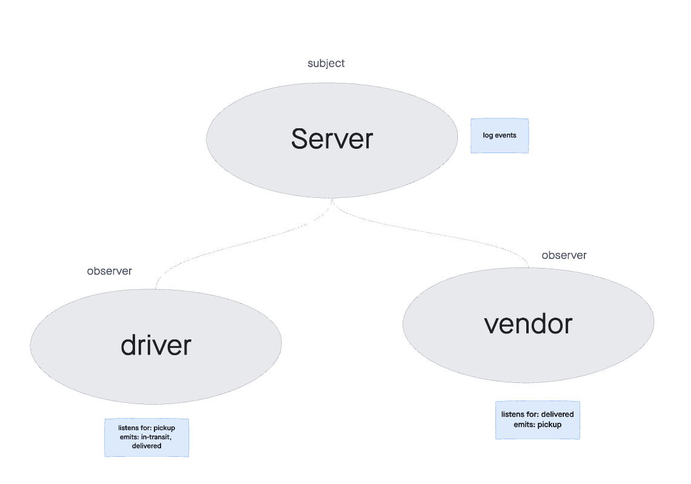

# CAPS ( Code Academy Parcel Service)

## Creaters

Created by Sarah Creager

## Problem Domain  

### Phase 1
The first of a 4-Phase build. Created an application with Event Driven Developement. Includes a module for managing global parcel events, a module for vendor events, and a module for driver events.  

### Phase 2
Rather than using Node Events to manage events, the application has been refactored to use socket.io, allowing pickups and deliveries to be viewed in realtime.

## User Stories

* As a vendor, I want to alert the system when I have a package to be picked up.  
* As a driver, I want to be notified when there is a package to be delivered.  
* As a driver, I want to alert the system when I have picked up a package and it is in transit.  
* As a driver, I want to alert the system when a package has been delivered.  
* As a vendor, I want to be notified when my package has been delivered.  

## Developer Stories

* As a developer, I want to use industry standards for managing the state of each package.  
* As a developer, I want to create an event driven system so that I can write code that happens in response to events, in real time.  

## Installation

1. `npm install`  

2. `npm start`

*sample .env file:*

``` 
PORT=3001

```

## Dependencies

 * jest
 * socket.io
 * socket.io-client

## Links

[GitHub](https://github.com/SarahCreager/caps.git)

## UML and Routes



## Collaboration

Classmates: Justin Hamerly and Antoine Charette
[socket.io docs](https://socket.io/docs/v4/)
